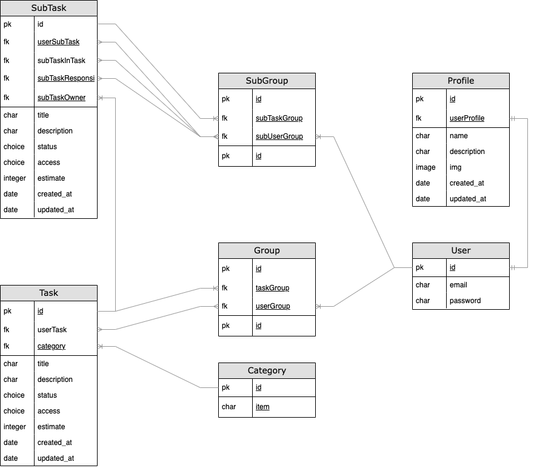

# Genius Chicken

## overviews
##### アプリ概要
##### インフラ構成
##### 技術選定
##### データベース設計
##### 実装機能

### *ゲストログインができます

## アプリ概要

Genius Chickenはタスク管理のためのWebアプリケーションです。

名前の由来は、覚えることのできるニワトリは天才だという考えからです。

アプリの用途は、基本的にはタスク管理ですがメモや日記としても使えると思います。

本来は大学の授業グループワークやゼミで使えそうな、複数人でタスクを管理できるアプリを作成する予定だったのですが、時間の関係上キリのいいとこでひとまず完成としました。

機能数はまだ少ないですが、これからも継続的に開発を進めていきます！

## インフラ構成

## データベース設計

## 技術選定
Backend
* Language: Python
* Framework: Django
* Database: MySQL

Frontend
* Language: TypeScript
* Library: React.js
* Framework: Next.js
* State Management: Context Api

Infrastructure
* Cloud: AWS
* Service: VPC, RDS, ECR, ECS, ALB, Route53, ACM, Cloud Watch
* IaaS: terraform
* PipeLine: Github Actions

Others
* Container: Docker, Docker-compose
* Web Server: Nginx
* Application Server: Gunicorn

## 実装機能
#### 機能要件
User Function
* Login
* Logout
* Create
* Gest Login

Task Function
* CRUD
* Task List
* Task Detail

Kategory Function
* Create (cant't Delete)

Pagination Function
* 20/perpage

Sorting Function
* Task, Status, Kategory, Create_at

Others
* Full Responsive Design
* Dark Mode
* Drawer Menu
* Snack Bar
* Loading
* Disable Button

#### 非機能要件
* Fetch: useSWR
* Rendering: SSG, ISR
