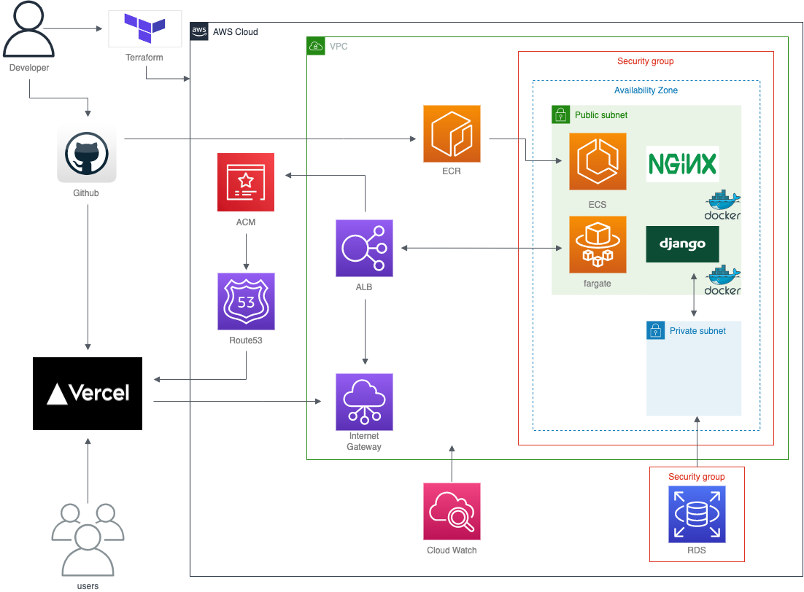

# Genius Chicken

## overviews
##### アプリ概要
##### 技術選定
##### インフラ構成
##### 機能要件・非機能要件

## アプリ概要
Genius Chickenはタスク管理のためのWebアプリケーションです。
名前の由来は、覚えることのできるニワトリは天才だという思想からです。
アプリの用途は、基本的にはタスク管理ですがメモや日記としても使えると思います。

## 技術選定
Backend
* Language: Python
* Framework: Django
* Database: MySQL

Frontend
* Language: TypeScript
* Library: React.js
* Framework: Next.js
* State Management: Context Api

Infrastructure
* Cloud: AWS
* Service: VPC, RDS, ECR, ECS, ALB, Route53, ACM, Cloud Watch
* IaaS: terraform
* PipeLine: Github Actions

Others
* Container: Docker, Docker-compose
* Web Server: Nginx
* Application Server: Gunicorn

## インフラ構成

## 機能要件・非機能要件
